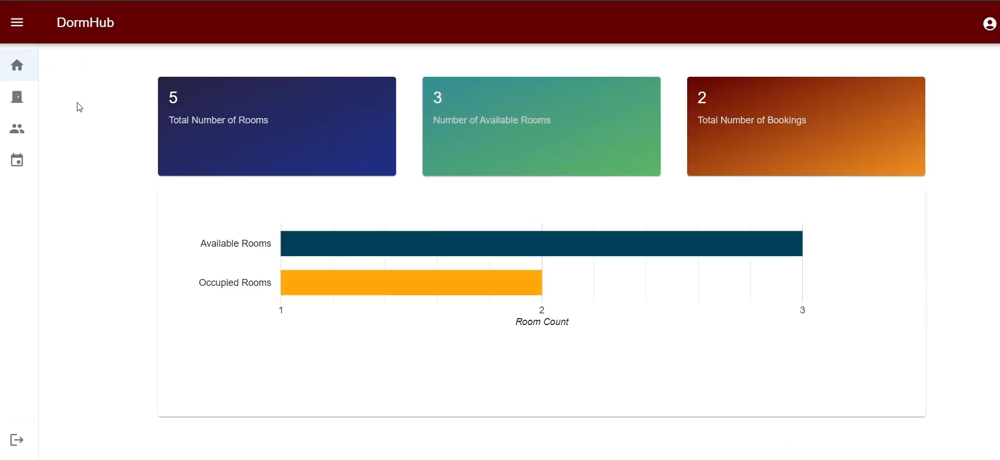
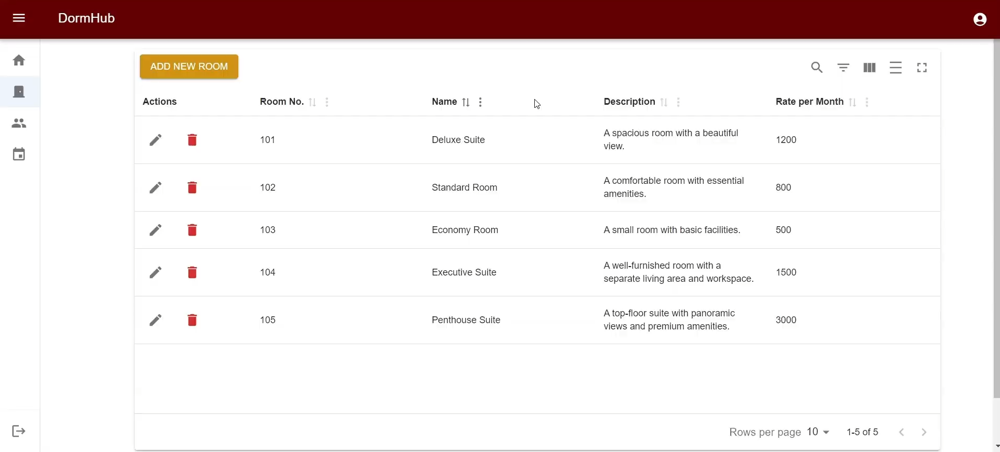
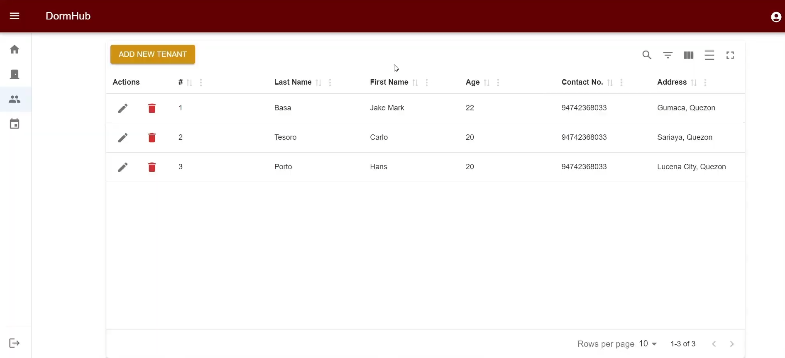

# 🏠 Dormitory Management System

A web-based application designed to simplify dormitory operations such as room assignments and tenant management.  
Built with **Node.js**, **Express**, and **React** for efficient and modern management of dormitory facilities.

---

## 📸 Project Screenshots

**Dashboard View**  

**Room Management**  

**Tenant Management**  

---

## 🚀 Features

- 📋 **Tenant Management** – Add, update, and track tenant details.
- 🏢 **Room Allocation** – Assign and monitor room occupancy.
- 🔐 **User Authentication** – Secure login for staff/admins.

---

## 🛠 Tech Stack

- **Frontend**: React, Vite, Tailwind CSS
- **Backend**: Node.js, Express.js
- **Database**: MongoDB
- **Others**: REST API, JWT Authentication

---

